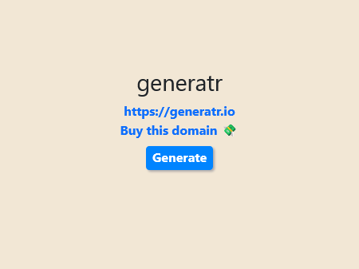

# generat<i>r</i> | [generatr.fly.dev](https://generatr.fly.dev/)

Generate the name for your next SaaS company or product! 💫



### Getting started
```shell
python -m venv .venv
source .venv/bin/activate
pip install -r requirements.txt
FLASK_APP=app.py FLASK_ENV=development FLASK_DEBUG=0 python -m flask run --no-debugger --no-reload
```

### Ideas

Ideas for future features:
- [x] Display history of generated names
- [x] Show price of domain
- [ ] Check for [Wordnik API key](https://www.wordnik.com/users/joeriddles/API)
- [ ] Multiple domain registrar links
- [ ] Monetization links?
